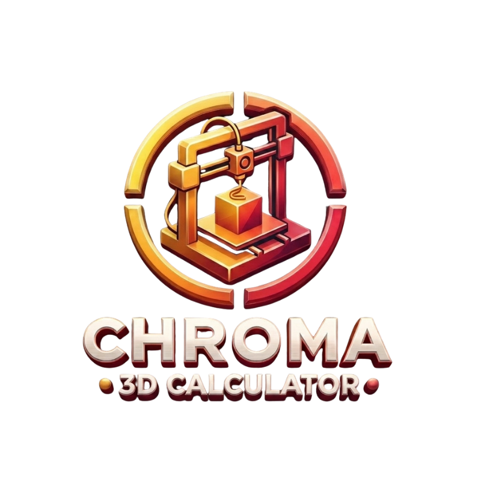

<p align="center">
  
</p>

# Sobre o Projeto

O Projeto se originou da ideia de simplificar a precificação de produtos impressos em 3D, assim como gerenciar todo o estoque de filamentos e impressoras a disposição

# Funcionalidades

- Calculo de gasto de filamento
- Gasto energético
- Gastos adicionais
- Margem de lucro
- Total para venda

**O Custo de Energia, por enquanto, está fixo no código interno do programa considerando R$ 0.85/kwh e uma impressora de 250 Watts, proximo Commit terá a opção de alterar**

## 🛠️ Stack Tecnológica

- **Framework Principal:** [React Native](https://reactnative.dev/) com [Expo (v51)](https://expo.dev/)
- **Linguagem:** [TypeScript](https://www.typescriptlang.org/)
- **Estilização:** Core `StyleSheet` do React Native
- **Navegação & Roteamento:** Expo Router (File-based routing)

## ⚙️ Como Executar o Projeto

Certifique-se de ter o [Node.js](https://nodejs.org/) instalado em seu computador e o aplicativo **Expo Go** instalado no seu dispositivo Android/iOS para testar.

### 1. Clonar o repositório e instalar dependências

```bash
# Instalar os pacotes necessários
npm install

2. Iniciar o servidor de desenvolvimento do Expo
Bash

npx expo start

3. Abrir no celular

    Android: Abra o aplicativo Expo Go no celular e leia o QR Code gerado no terminal.

    Emulador Android/iOS: Pressione a para rodar no Android Studio ou i para o simulador iOS.
```

📐 Estrutura de Pastas do Projeto
Plaintext

```
assets/
├── images/          # Imagens e logos utilizadas no projeto
src/
├── components/
│   └── ui/          # Componentes menores reutilizaveis como cards, buttons e inputs
├── hooks/           # Centralização de lógica e estados
├── screens/         # Principais telas do aplicativo
```
